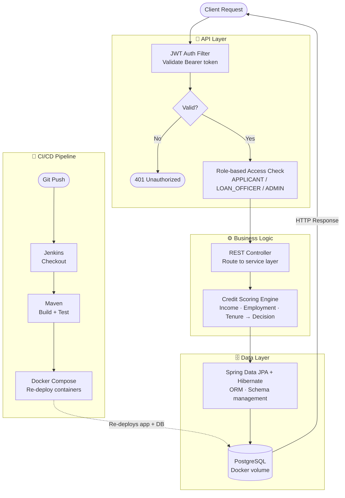

# SmartLoan: Credit Decision Platform

A production-ready loan application and credit decisioning backend built with **Spring Boot**, secured with **JWT authentication**, containerized using **Docker**, and deployed via an automated **Jenkins CI/CD pipeline**.

---

## Features

- **Credit Scoring Engine** — Automatically evaluates loan applications based on income, employment type, and tenure to deliver instant approve/reject decisions
- **JWT Authentication** — Stateless, token-based authentication with role-based access control for three roles: `APPLICANT`, `LOAN_OFFICER`, and `ADMIN`
- **Secure REST APIs** — Built with Spring Security and Spring Boot Validation for robust, production-grade endpoints
- **ORM with JPA & Hibernate** — Clean database interactions with PostgreSQL via Spring Data JPA, with auto-managed schema generation
- **Containerized Deployment** — Docker Compose orchestrates the Spring Boot app and PostgreSQL with persistent volumes and a custom bridge network
- **CI/CD Pipeline** — Jenkins pipeline (Pipeline-as-Code via `Jenkinsfile`) automates checkout, Maven build, and Docker deployment on every push

---

## Tech Stack

| Layer | Technology |
|---|---|
| Language | Java 17 |
| Framework | Spring Boot 3.5, Spring Security, Spring Data JPA |
| Auth | JWT (jjwt 0.11.5) |
| Database | PostgreSQL 15 |
| ORM | Hibernate, Lombok |
| Build Tool | Maven |
| Containerization | Docker, Docker Compose |
| CI/CD | Jenkins (Declarative Pipeline) |

---

## Project Structure

```
smartloan/
├── src/
│   └── main/
│       ├── java/com/smartloan/    # Application source code
│       └── resources/             # application.properties
├── Dockerfile                     # Docker image definition
├── docker-compose.yml             # Multi-container orchestration
├── Jenkinsfile                    # CI/CD pipeline definition
└── pom.xml                        # Maven dependencies
```

---

## Getting Started

### Prerequisites

- Docker & Docker Compose installed
- Java 17+
- Maven 3.8+

### Run with Docker Compose (Recommended)

```bash
# Clone the repository
git clone https://github.com/Atharva031/smartloan.git
cd smartloan

# Start the app and PostgreSQL
docker compose up --build -d
```

The application will be available at `http://localhost:8080`
PostgreSQL runs on port `5432` with the database `smartloandb`

### Run Locally (Without Docker)

```bash
# Build the project
./mvnw clean package -DskipTests

# Run the JAR
java -jar target/smartloan-0.0.1-SNAPSHOT.jar
```

> Make sure a PostgreSQL instance is running locally and update `src/main/resources/application.properties` with your DB credentials.

---

## CI/CD Pipeline

The Jenkins pipeline automates the full delivery workflow:

```
Checkout → Maven Build → Docker Compose Down → Docker Compose Up (rebuild)
```

Defined in `Jenkinsfile` as a declarative Pipeline-as-Code. On every push to `main`, Jenkins pulls the latest code, builds the JAR via Maven, and re-deploys the containerized application.

---

## API Overview

| Method | Endpoint | Access |
|---|---|---|
| POST | `/api/auth/register` | Public |
| POST | `/api/auth/login` | Public |
| POST | `/api/loans/apply` | APPLICANT |
| GET | `/api/loans/{id}` | APPLICANT, LOAN_OFFICER |
| PUT | `/api/loans/{id}/review` | LOAN_OFFICER |
| GET | `/api/admin/users` | ADMIN |

> Use the JWT token returned from `/api/auth/login` as a Bearer token in the `Authorization` header for all protected routes.

---

## Application Flow



---

## Author

**Atharva Kulkarni**
- LinkedIn: [linkedin.com/in/kulkarniatharva](https://www.linkedin.com/in/kulkarniatharva/)
- GitHub: [github.com/Atharva031](https://github.com/Atharva031)
- Email: atharva.kulkarni031@gmail.com
